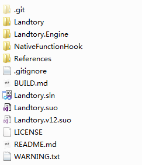
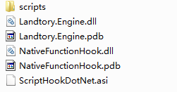

# Build Landtory

In the following list, you will get all the libs and things you require.

## Requirements

These are the library you require.

|          Name          |                       Factor                        |       Included       |
| :--------------------: | :-------------------------------------------------: | :------------------: |
|    AdvancedHook.dll    |    Used to make some of Landtory functions work     |     NOT INCLUDED     |
|  ScriptHookDotNet.dll  |                The basic of Landtory                |       INCLUDED       |
| NativeFunctionHook.dll | Project of this file are included in the repository | SOURCE CODE INCLUDED |
|  Newtonsoft.Json.dll   |                Used to make settings                |     NOT INCLUDED     |

You also require these tools:

|            Name             |              Factor              | Included | Required |
| :-------------------------: | :------------------------------: | :------: | :------: |
| Visual Studio 2013 or later |  IDE to build the Landtory code  |    NO    |   Yes    |
|       Git for Windows       | The tools to acquire latest code |    NO    |   Yes    |
|       Github Plug-in        |        Recommended to use        |    NO    |    No    |

## How to build

First, open the **Git Bash** or **Git CMD**. Then, type the following code:

`git clone https://github.com/RelaperCrystal/Landtory.git`

The command will clone the latest code into your machine.

Then, Place AdvancedHook.dll into the References folder. Open the `Landtory.sln` using Visual Studio 2013 or later. You may notified the Solution version is for 2010, because the project was created by that but moved to 2013 Later, and now using .NET Framework 4.5. **Do not open the Solution using Visual Studio 2010 at any rate. It may broke the code. If you do that, Please re-clone a copy of codes and do not make any commits, push.**

Open Your Visual Studio, click Build in your menu bar. Build the whole solution.

After building Landtory, please make sure you copied the files into GTAIV like This:

In The Scripts Folder, rename `Landtory.dll` into `Landtory.net.dll` to make sure .NET Script Hook load the Landtory. The Main Logic inside the `Landtory.dll` is to make some script-only functions and load the `Landtory.Engine.dll`, `NativeFunctionHook.dll`.